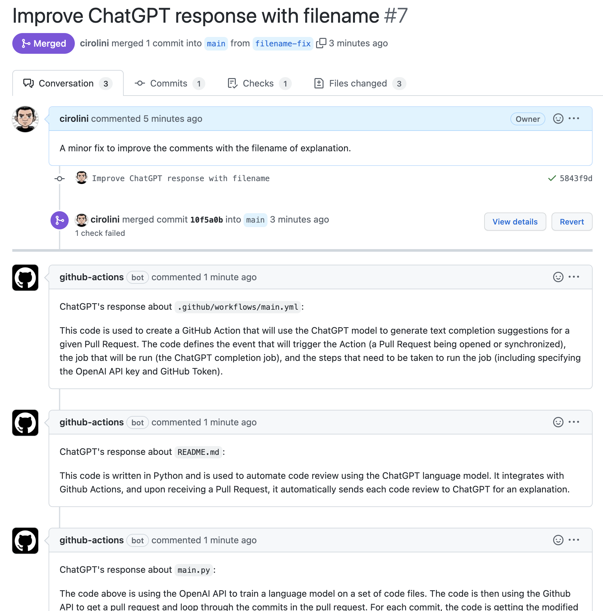

# Code Review with ChatGPT

This project aims to automate code review using the ChatGPT language model. It integrates  with Github Actions, and upon receiving a Pull Request, it automatically sends each code review to ChatGPT for an explanation.

### Prerequisites
- OpenAI API Key

# Prerequisite

First, you will need a personal API key from OpenAI which you can get here: https://openai.com/api/. To get an OpenAI API key, you can sign up for an account on the OpenAI website https://openai.com/signup/. Once you have signed up, you can create a new API key from your account settings.

After creating your API Key in OpenAI, create it as a secret in your repository or organization with the following name: openai_api_key.

You can do this by going to your repository/organization's settings, navigate to secrets and create a new secret with the name 'openai_api_key' and paste your OpenAI API key as the value.

Then you need to set up your project's permissions so that the Github Actions can write comments on Pull Requests. You can read more about this here: [automatic-token-authentication](https://docs.github.com/en/actions/security-guides/automatic-token-authentication#modifying-the-permissions-for-the-github_token)

### How it works

This action is triggered when a pull request is opened or updated. The action authenticates with the OpenAI API using the provided API key, and with the Github API using the provided token. It then selects the repository using the provided repository name, and the pull request ID. 
For each commit in the pull request, it gets the modified files, gets the file name and content, sends the code to ChatGPT for an explanation, and adds a comment to the pull request with ChatGPT's response.

## Built With
- [OpenAI](https://openai.com/) - The AI platform used
- [Github Actions](https://github.com/features/actions) - Automation platform

## How to Use

In your github repository create a file in `.github/workflows/chatgpt.yml`.

```
on:
  pull_request:
    types: [opened, synchronize]

jobs:
  hello_world_job:
    runs-on: ubuntu-latest
    name: ChatGTP explain code
    steps:
      - name: ChatGTP explain code
        uses: cirolini/chatgpt-github-actions@v1
        with:
          openai_api_key: ${{ secrets.openai_api_key }}
          github_token: ${{ secrets.GITHUB_TOKEN }}
          github_pr_id: ${{ github.event.number }}
      
```

This is an example of how to use this action in your workflow, which is triggered by pull request events. It uses the `openai_api_key`, `github_token`, and `github_pr_id` inputs to authenticate with the OpenAI API and Github API, and provide the necessary information for the action to run.

Comments will appear like this:



## Authors
- **CiroLini** - [cirolini](https://github.com/cirolini)